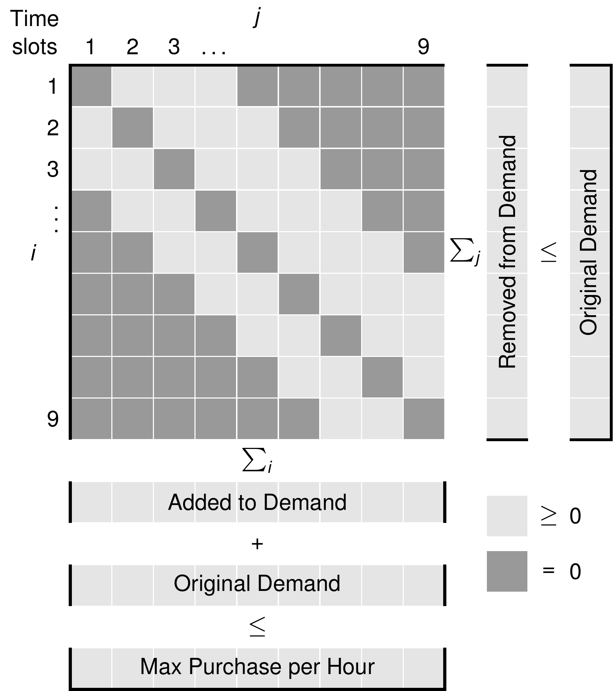
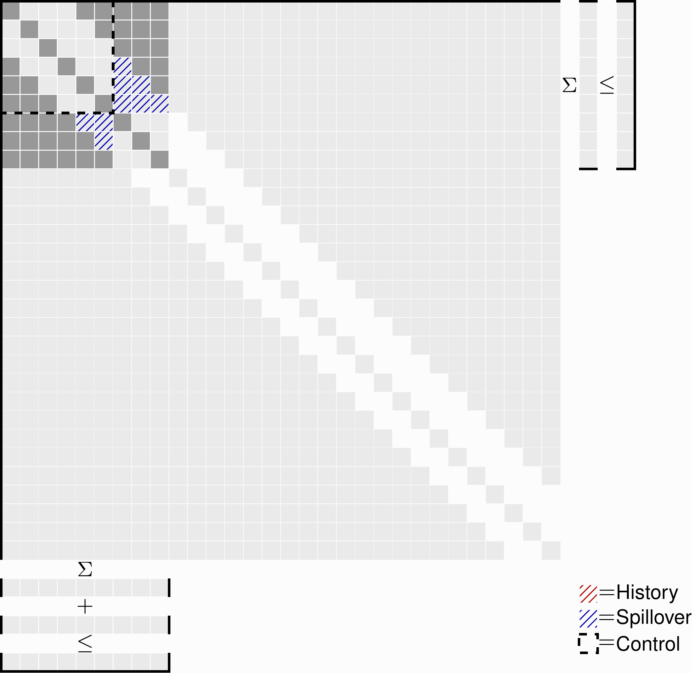

# Technical Documentation
Load shifting can be viewed as virtual storage, and the code uses this terminology. In practice, load shifting is implemented via a **Transfer Matrix** `T[i,j]` representing the amount of energy originally demanded at time `i` but purchased at time `j`. Optimizing load shifts thus corresponds to finding values for `T[i,j]` that minimize the cost of procured electricity while satisfying all flexibility constraints.

  

**Key transfer matrix properties:**
- **Row sum** `Σⱼ T[i,j]`: Represents energy removed from time `i`
- **Column sum** `Σᵢ T[i,j]`: Represents energy added to time `j`

**Typical flexibility constraints include:**
1. **Temporal flexibility**: How many time units a load can be shifted earlier or later, defined by which elements in `T[i,j]` can be non-zero. For example, in the visualization above, loads can be shifted 2 hours earlier or 3 hours later.
2. **Maximum power**: The sum of original demand and added energy must not exceed the maximum allowed power at any time.
3. **Energy conservation**: Energy removed from any time period cannot exceed the original demand at that time.

## Moving Horizon Control Strategy
The optimizer provides a **moving horizon control** strategy that facilitates daily optimization runs, mimicking real-world scenarios in which price information becomes available incrementally. For example, day-ahead spot prices for the next day are revealed in the afternoon, enabling day-by-day load optimization. In practice, this iteratively solves small portions of a larger transfer matrix, as shown in the animation below.

  

**Key Time Periods:**
- **Lookahead Period**: The whole horizon optimized (the period with available price information).
- **Control Period**: The period that is implemented in practice (typically 24 hours for day by day).
- **History**: Historical decisions from previous optimizations (constraints)
- **Spillover**: Potential Energy transfer to/from the next control period (spillover).

However, this iterative process risks adding/removing consumption to/from the next period if the horizon with known prices is longer than the control horizon (24 hours for day-by-day optimization). Extra bookkeeping is needed to account for this when solving optimization problems over successive days. This bookkeeping is illustrated in the animation above, where spillover from period `n` becomes a historical constraint when optimizing loads for period `n+1`.